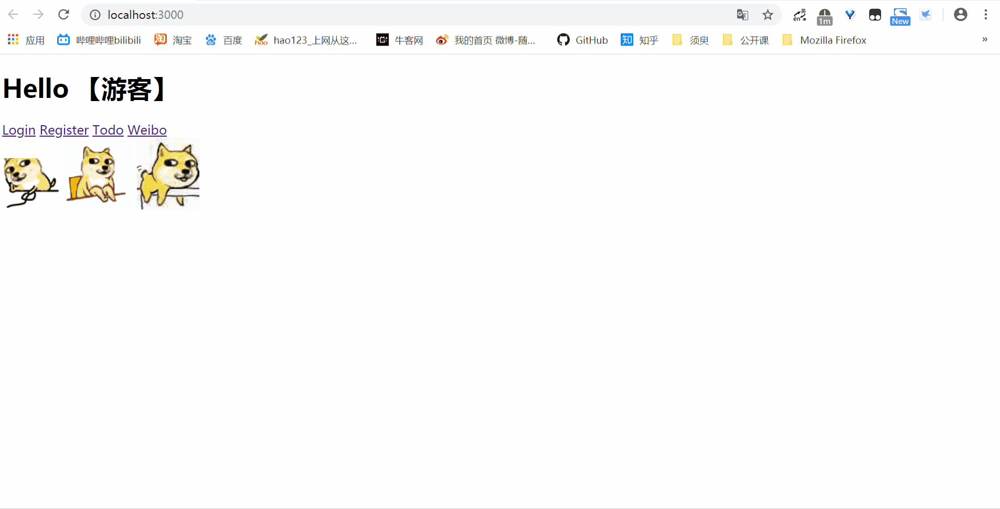
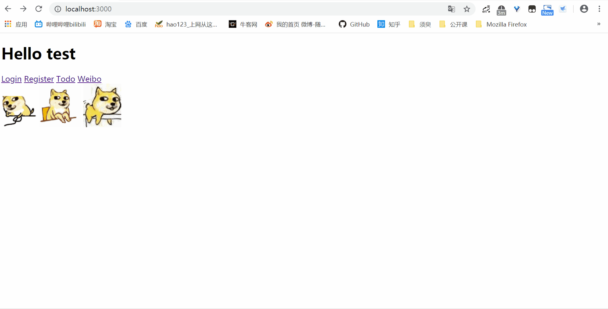

基于 Socket 的 http 服务器及 MVC Web 框架---并实现类微博 APP demo
===

简介
---

- SERVER:
    - 支持协议:
        - HTTP 协议
            - 可以解析/拼接 HTTP 报文。
        - WSGI 协议
            - 针对 WSGI 协议进行封装, 根据 WSGI 请求响应的数据格式进行数据清洗。
            - 可托管在 Gunicorn 应用服务器上。
    - 多线程处理请求
    - 转发请求至相应路由, 返回响应结果
- MVC 框架:
    - Model:
        - 基于 MySQL 语句的 ORM
            - 提供底层 Model 基类, 实现常用增删改查类方法
            - 具体 Model 如 User, Weibo 继承基类
    - View:
        - 使用 jinja2 进行网页的渲染
    - Control: 
        - 用字典映射 url 与 route, 实现类似 flask 的蓝图管理, 利用了 Python 的高阶函数进行登录验证等
            
            
**功能演示**

- 用户登录

- TODO事务的增删改查

- WeiBo APP

